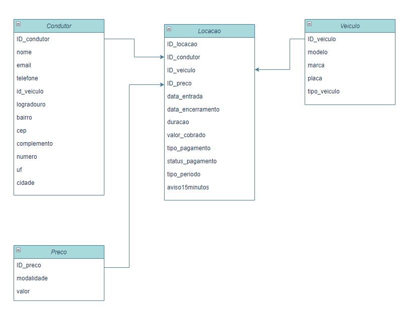

# _**Documentação Funcional de Sistema de Parquímetro**_

## _Introdução_

Esta documentação apresenta o novo sistema de parquímetro que deve ser desenvolvido para atender às
necessidades de uma cidade turística, que possui uma população de 300.000 habitantes, mas experimenta um
aumento significativo durante a alta temporada, recebendo 250.000 visitantes adicionais, em média, com a mesma
quantidade de veículos. Este sistema substituirá o sistema antigo, que é lento, não escalável e não confiável.

## _Visão Geral do Sistema_

O novo sistema de parquímetro foi projetado para lidar com a demanda crescente de estacionamento na
cidade. Ele oferece funcionalidades tais, como registro de condutores e veículos, controle de tempo estacionado,
opções flexíveis de pagamento e emissão de recibos.

## _Funcionalidades Principais_

### _1. Registro de Condutores e Veículos_
- Os condutores podem se registrar no sistema, associando seus dados pessoais, como nome, endereço e
  informações de contato.
- Um condutor pode vincular vários veículos à sua conta, facilitando o gerenciamento de múltiplos veículos.
### _2. Registro de Forma de Pagamento_
- Antes de usar o sistema, o condutor deve registrar sua forma de pagamento preferida, que pode incluir
  cartão de crédito, débito ou PIX.
- A opção PIX só está disponível para períodos de estacionamento fixos.
### _3. Controle de Tempo Estacionado_
- O sistema permite iniciar o período de estacionamento, oferecendo opções de tempo fixo ou por hora.
- Para períodos fixos, o sistema requer que o condutor indique a duração desejada no momento do registro.
- Para períodos variáveis, o sistema inicia o tempo de estacionamento automaticamente.
- O sistema monitora o tempo com precisão para garantir a cobrança correta.
### _4. Alertas de Tempo Estacionado_
- O sistema inclui um recurso de alerta que notifica o condutor quando o tempo de estacionamento está
  prestes a expirar, no caso de horário fixo.
- Para períodos variáveis, o sistema também emite um alerta informando que o sistema estenderá
  automaticamente o estacionamento por mais uma hora, a menos que o condutor desligue o registro.
### _5. Opções de Pagamento_
- Os condutores têm a opção de pagar pelo estacionamento de várias maneiras, incluindo cartão de crédito,
  débito ou PIX, dependendo da forma de pagamento registrada.
- A cobrança é baseada no tempo utilizado; para tempos fixos, o valor total é cobrado independentemente do
  tempo real utilizado, enquanto para períodos variáveis, a cobrança é por hora completa.
  Pós-Tech Arquitetura e Desenvolvimento JAVA – 1ADJT Página 1 de 2
### _6. Emissão de Recibos_
- O sistema emite recibos automaticamente sempre que o tempo de estacionamento é encerrado e a
  cobrança é realizada.
- Os recibos fornecem informações detalhadas, incluindo o tempo estacionado, a tarifa aplicada e o valor
  total pago.

## _Fluxo de Trabalho_
#### 1. O condutor se registra no sistema, fornecendo informações pessoais.
#### 2. O condutor registra sua forma de pagamento preferida (cartão de crédito, débito ou PIX).
#### 3. O condutor inicia o registro de tempo no sistema, escolhendo entre tempo fixo (indicando a duração desejada) ou
   por hora.
#### 4. O sistema monitora o tempo de estacionamento e cobra o valor adequado com base nas opções de pagamento
   selecionadas.
#### 5. Para horários fixos, o sistema emite um alerta quando o tempo está prestes a expirar.
#### 6. Para períodos variáveis, o sistema emite um alerta informando que estenderá automaticamente o estacionamento
   por mais uma hora, a menos que o condutor desligue o registro.
#### 7. Quando o tempo de estacionamento é encerrado, o sistema emite um recibo para o condutor.
 
## _Informações Técnicas_

### _Banco de Dados:_
#### Postgre
### _Nome da Base:_
#### Parquimetro-api

### _SMTP:_
#### smtp.gmail.com
#### spring.mail.username=  adicione o email
#### spring.mail.password=   essa senha pode ser obtida no gmail em segurança / dupla autênticação, solicitar a criação de uma senha.

### _Repositório do Programa_
#### [Paquimetro_api](https://github.com/MarcosHRFerreira/parquimetro_api.git)

### _Diagrama de Classe_

#### 

### _Swaager_
#### http://localhost:8080/swagger-ui.html

## _Informações do Cadastro:_

### 1. Efetuar o cadastro do Veiculo

{
"modelo":"POLO",
"marca":"VOLKSWAGEN",
"PLACA":"EEA8855",
"tipo_veiculo":"AUTOMOVEL"
}

### 2. Efetuar o cadastro do Condutor

{
"nome": "Zé",
"email":"ze@gmail.com",
"telefone":"121111",
"id_veiculo": 4,
"endereco":{
"logradouro":"RUA DO ZE",
"bairro": "BAIRRO DO ZE",
"cep":"12345678",
"uf":"SP",
"cidade":"SAO PAULO",
"numero":"436"
}

### 3. Efetuar o cadastro do Preço

{
"modalidade": "HORA_CHEIA",
"valor": 16.0
}

### 4. Efetuar o cadastro da Locação

{
"data_entrada": "2024-07-26T18:30:10",
"data_encerramento": "",
"duaracao": 1,
"valor_cobrado": 16.0,
"tipo_periodo":"HORA",
"tipo_pagamento":"CARTAO_CREDITO",
"status_pagamento":"PENDENTE",
"id_condutor": 1,
"id_veiculo": 1,
"id_preco": 1
}

### 6. Como Funciona:

Ao subir a aplicação, será lançada o evento de SCHEDULED:

@Scheduled(fixedDelay = 1, timeUnit = TimeUnit.MINUTES) dentro da classe AlertaLocacaoService

A cada minuto, buscará na base todas locações em aberto com a data de encerramento = NULL

Será efetuada analise para a locação corrente, para avisos ou alteração de periodo.

Será enviado um aviso quando a locação estiver próxima do término (15 minutos antes) ou quando o período de locação for excedido.

O email utilizado será do condutor.

Para finalizar a locação:

{
"id_locacao":2,
"data_encerramento": "2024-07-27T22:47",
"status_pagamento":"EFETUADO"
}

O processo de finalização da locação, com a atualização da data de encerramento e o status do pagamento, 
é fundamental para registrar o término da locação e gerar o recibo.

